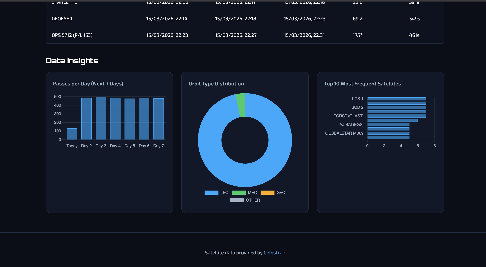
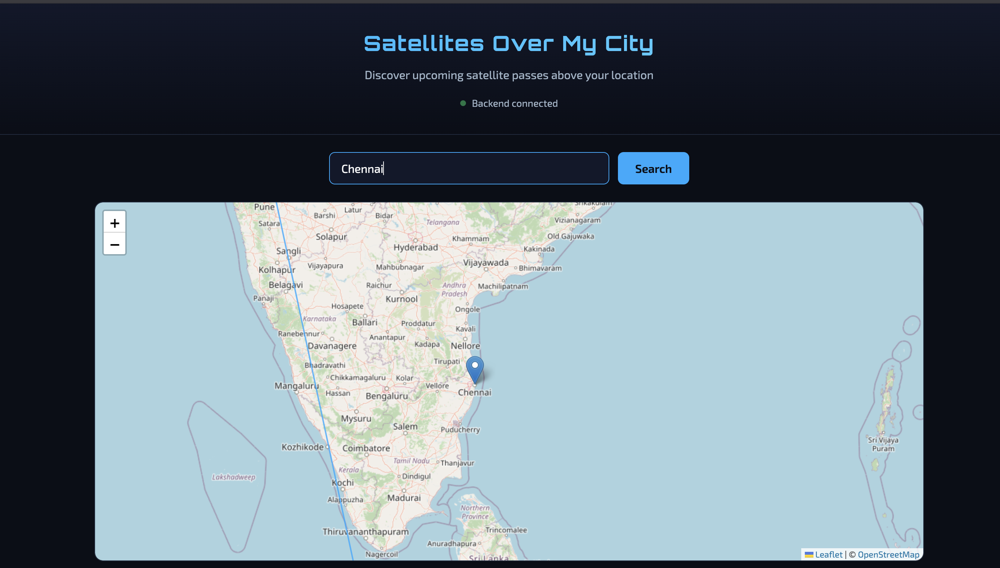
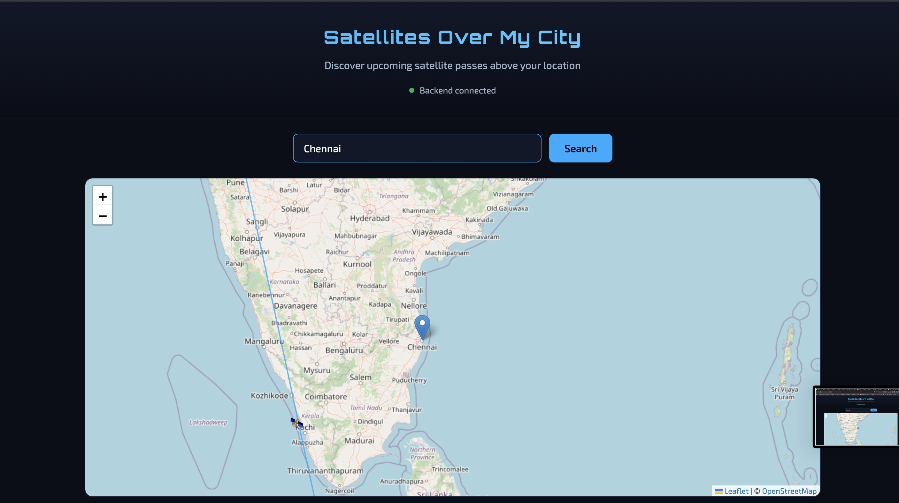
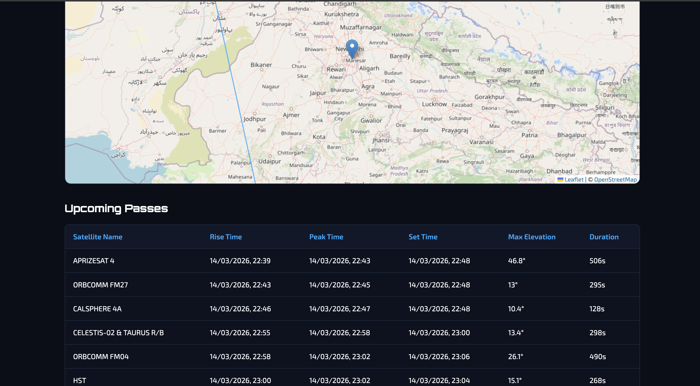

# Satellites Over My City

A full-stack web application that shows upcoming satellite passes over any city using real TLE (Two-Line Element) data from Celestrak. Enter a city name to see satellite passes, view animated ground tracks on a map, and explore data insights with interactive charts.

## Demo

<p align="center">
  
</p>
<p align="center"><em>Search for a city to see satellite passes</em></p>

<p align="center">
  
</p>
<p align="center"><em>Interactive map with satellite ground track</em></p>

<p align="center">
  
</p>
<p align="center"><em>Upcoming satellite passes table</em></p>

<p align="center">
  
</p>
<p align="center"><em>Data insights dashboard with charts</em></p>

---

## Features

- **City search** — Enter any city name to get upcoming satellite pass predictions
- **Interactive map** — Leaflet map with satellite ground track and animated position
- **Pass list** — Table of rise time, peak time, set time, max elevation, and duration
- **Data dashboard** — Charts for passes per day, orbit type distribution, and top satellites
- **Real-time position** — Current lat/lon/altitude for any satellite by NORAD ID

## Tech Stack

- **Backend:** Python, Flask, SQLite, pyorbital
- **Frontend:** HTML, CSS, JavaScript, Leaflet.js, Chart.js
- **Data:** Celestrak (TLE), OpenStreetMap Nominatim (geocoding)

---

## Prerequisites

- Python 3.9+
- macOS (project tested on Apple Silicon; setup script handles architecture)

---

## Setup

### 1. Create virtual environment (required on macOS)

Always use `python3 -m venv` and `python3 -m pip` to avoid pip/python mismatches:

```bash
cd satellite-app/backend
./setup_venv.sh
```

Or manually:

```bash
cd satellite-app/backend
python3 -m venv venv
source venv/bin/activate
python3 -m pip install -r requirements.txt
```

**Apple Silicon users:** If you see architecture errors (arm64/x86_64), run `./setup_venv.sh` which uses `arch -arm64` to ensure native Python.

### 2. Start the backend

```bash
cd satellite-app/backend
source venv/bin/activate
python3 app.py
```

Backend runs at **http://localhost:5001** (port 5000 is often used by macOS AirPlay). Set `PORT=5000` to override.

### 3. Load satellite data (run once)

```bash
curl -X POST http://localhost:5001/api/satellites/refresh
```

This fetches ~14,000 active satellites from Celestrak. Takes 10–30 seconds.

### 4. Start the frontend

In a new terminal:

```bash
cd satellite-app/frontend
python3 -m http.server 8080
```

Open **http://localhost:8080** in your browser.

### 5. Stop the servers

Press **Ctrl+C** in each terminal where the backend or frontend is running.

---

## Deploy to Railway

1. **Sign up** at [railway.app](https://railway.app) and connect your GitHub account.

2. **New Project** → **Deploy from GitHub repo** → select `Coriolis-satellite-predictor-app`.

3. **Configure the service:**
   - Railway auto-detects the Procfile
   - Set **Root Directory** to empty (repo root) — the Procfile runs from backend
   - Add a variable: `FLASK_ENV` = `production` (optional, disables debug)

4. **Generate domain:** In the service → **Settings** → **Networking** → **Generate Domain**. You'll get a URL like `https://xxx.railway.app`.

5. **Load satellite data** (after first deploy):
   ```bash
   curl -X POST https://YOUR-RAILWAY-URL.railway.app/api/satellites/refresh
   ```

6. **Important:** Railway uses ephemeral storage. The SQLite database resets on redeploy. Run `/api/satellites/refresh` after each deploy to repopulate TLE data.

**Note:** For persistent data, add a Railway Volume and mount it to `backend/database/` in the dashboard.

---

## Project Structure

```
satellite-app/
├── backend/
│   ├── app.py              # Flask app, CORS, health check
│   ├── config.py           # URLs, DB path, constants
│   ├── requirements.txt
│   ├── setup_venv.sh       # Venv setup (fixes architecture issues)
│   ├── database/
│   │   └── db.py           # SQLite: satellites, passes
│   ├── services/
│   │   ├── celestrak.py    # Fetch & parse TLE data
│   │   └── pass_predictor.py  # Pass prediction, geocoding, ground track
│   └── routes/
│       ├── satellites.py   # /api/satellites, /api/satellites/refresh
│       └── passes.py       # /api/passes, /api/passes/top, /api/position, /api/stats
└── frontend/
    ├── index.html
    ├── style.css
    └── app.js
```

---

## API Endpoints

| Method | Endpoint | Description |
|--------|----------|-------------|
| GET | `/api/health` | Health check |
| GET | `/api/satellites` | List all satellites in DB |
| POST | `/api/satellites/refresh` | Fetch fresh TLE data from Celestrak |
| GET | `/api/passes?city=Chennai&hours=24` | Upcoming passes over a city |
| GET | `/api/passes/top?city=Chennai` | Top 10 satellites by pass count |
| GET | `/api/position?norad_id=25544` | Current satellite position (e.g. ISS) |
| GET | `/api/stats?city=Chennai` | Dashboard stats: total passes, orbit distribution, etc. |

---

## Troubleshooting

**Architecture error (arm64/x86_64):** Run `./setup_venv.sh` or recreate venv with `arch -arm64 python3 -m venv venv`.

**Port 5001 in use:** Set `PORT=5002 python3 app.py`. The frontend auto-detects localhost:5001 when run on port 8080.

**City not found:** Try different spellings or use a larger city name.

**Slow performance:** Pass prediction checks 300 satellites. Reduce the limit in `routes/passes.py` for faster results.

---

## Data Credit

Satellite TLE data provided by [Celestrak](https://celestrak.org). Geocoding by [OpenStreetMap Nominatim](https://nominatim.openstreetmap.org/).
